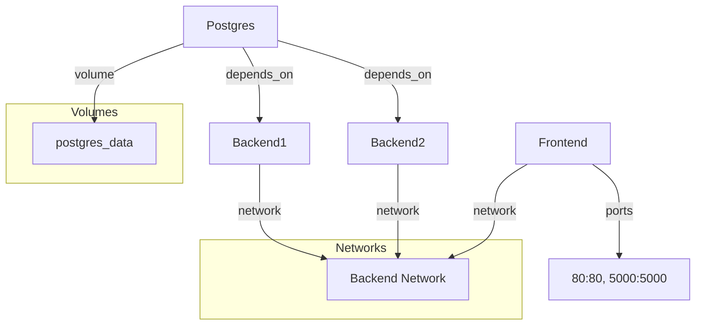

# mate-freineto.github.io

## Diagram

```mermaid
graph TD;
    A[Postgres] -->|depends_on| B[Backend1]
    A[Postgres] -->|depends_on| C[Backend2]
    B[Backend1] -->|network| D[Backend Network]
    C[Backend2] -->|network| D[Backend Network]
    E[Frontend] -->|network| D[Backend Network]
    E[Frontend] -->|ports| F[80:80, 5000:5000]

    subgraph Volumes
        G[postgres_data]
    end

    subgraph Networks
        D[Backend Network]
    end

    A[Postgres] -->|volume| G[postgres_data]
```
